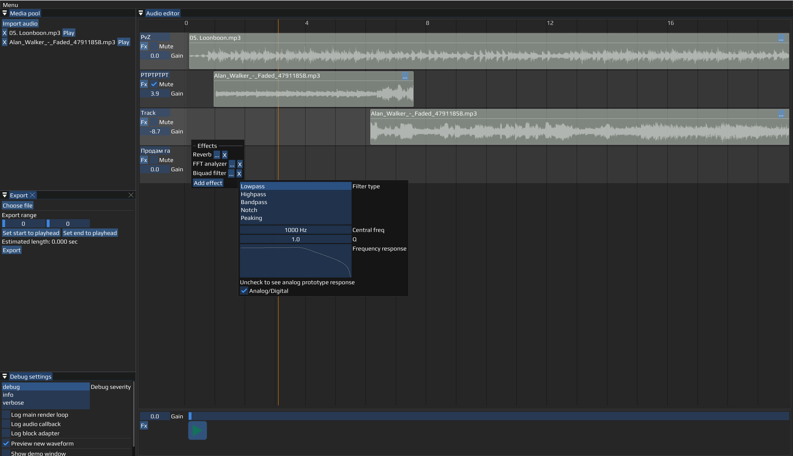
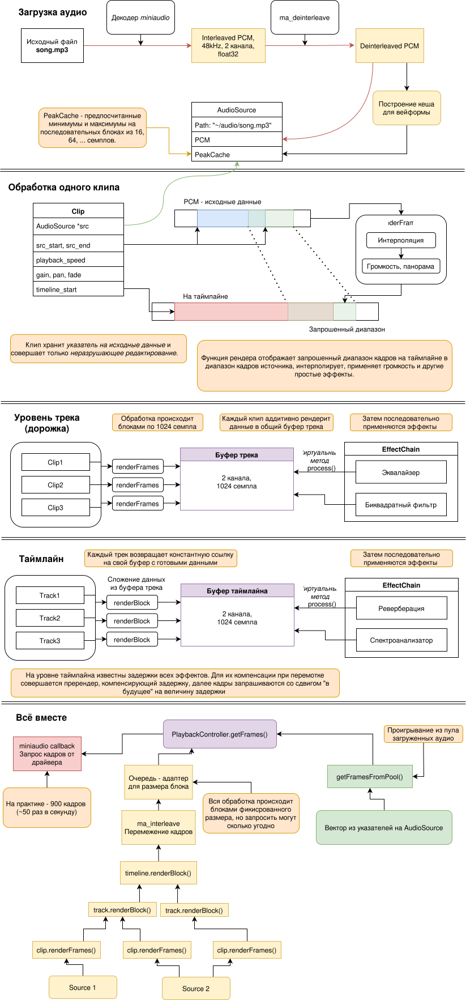
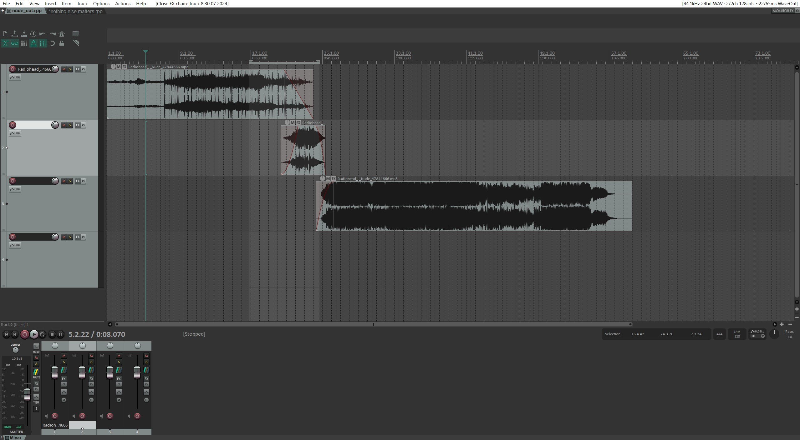
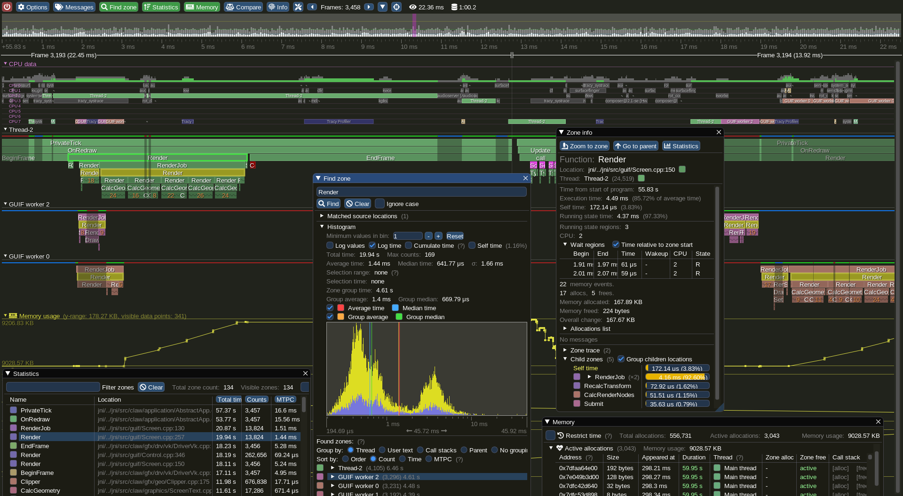

# Аудиоредактор на C++

## Описание проекта

Визуальный аудиоредактор


TODO:

+ улучшить спектроанализатор

## Оглавление

+ [Сборка](#сборка)
+ [Основные возможности](#возможности)
+ [Эффекты](#эффекты)
+ [Архитектура проекта](#архитектура-проекта)
+ [Зависимости](#внешние-зависимости)
+ [Источники](#источники)

## Сборка

```bash
git clone https://github.com/orientiered/KneeSound.git
cd KneeSound
git submodule update --init --recursive
cmake -S . -B build -DENABLE_ASAN=OFF
cmake --build build -j${nproc}
```

*SFML собирается из исходников, ошибки сборки могут быть вызваны отсутствием в системе его зависимостей*

**Запуск только из папки проекта(из-за относительного пути до шрифта):** `./build/KneeSound`

**Примечания** для `Windows`:

Компиляция проверена только для `mingw` (`MSVC` не поддерживает typeof)

Запуск: `.\build\KneeSound`

## Возможности

Рассмотрим процесс работы в KneeSound:

### Загрузка

+ Поддерживаемые входные форматы: WAV, FLAC, MP3 ( с помощью `miniaudio`)

После загрузки файл будет отображаться в окне `Media pool`, здесь же его можно предварительно прослушать или закрыть.

Аудио полностью декодируется в двухканальный float32 с частотой дискретизации 48 кГц, поэтому для больших mp3/flac это может занимать несколько секунд.

Как уже было сказано, вся дальнейшая **обработка** происходит для **двухканального аудио 48 кГц**.

### Создание клипов и базовые манипуляции с ними

Перетащите название загруженного трека из медиа пула на таймлайн в любое место - в этом месте появится клип.

Клипы можно свободно перетаскивать мышкой по таймлайну, если выделить их нажатием ЛКМ.

Поддерживаются сочетания клавиш Ctrl+C, Ctrl+X, Ctrl+V: выделенный клип можно скопировать или вырезать, а также вставить из буфера обмена в положение курсора.

### Работа с клипами

Выделенный клип можно разрезать по положению проигрывающей головки на два, нажав `X`

Клип можно обратимо обрезать/восстановить, потянув за любой из краёв клипа

Если при этом зажать alt, то можно будет ускорить/замедлить клип, растянув его.

При помощи меню, доступного из верхней панели клипа по кнопке `...`, можно редактировать

+ Громкость (gain)
+ Панораму (pan) - регулировка соотношения между левым и правым каналом
+ Выключить (mute)
+ Настроить линейное затухание (fade in/out)
+ Растянуть/сжать (time-stretch)

Также можно посмотреть настроить цвет клипа, вид вейвформы

### Треки (дорожки)

У дорожки можно поменять название, настроить громкость (gain), замутить, а также добавить эффекты (Fx)

### Таймлайн

Для перемещения по таймлайну используется колёсико мыши либо ползунок/

Чтобы изменить масштаб, нужно при этом зажать `Ctrl`

Для изменения высоты дорожек нужно зажать `Shift`.

Для паузы/старта проигрывания используется пробел или кнопка на нижней панели.

Курсор проигрывания перемещается нажатием мыши по пустому месту на таймлайне.

Можно настроить общую громкость и добавить эффекты (Fx)

### Экспорт

Окно экспорта открывается в меню на главной панели сверху.

Нужно выбрать выходной файл, а также точки начала и конца рендера.

Рендер начнется после нажатия кнопки `Export`.

**Примечание:** во время экспорта все проигрывание останаваливается.

Выходной файл будет в формате float32 WAV.

### Сохранение и открытие проекта

В меню на главной панели можно импортировать или экспортировать проект.

Проект сохраняется в `.ksp` (`json`) файл.

Оригинальное аудио при этом не сохраняется, только абсолютный путь до него.

## Эффекты 

На дорожки и таймлайн можно применять цепочки эффектов.

В редакторе используется система эффектов, похожая на VST3. Каждый эффект состоит из 3 частей:

+ `kernel`, совершающий обработку аудио 
+ `view`, отрисовывающий настройки эффекта и применяющий их
+ `factory`, предоставляющий интерфейс для создания эффекта и получения информации о нём

Следующие эффекты доступны по умолчанию:

### Эквалайзер (FFT equalizer)

+ Lowpass - фильтр низких частот
+ Highpass - фильтр высоких частот
+ Bandpass - полосовой фильтр
+ Rejector - режекторный фильтр (подавляет полосу)
+ K-Band   - многополосный эквалайзер

Изменения применяются после нажатия 'Apply'.

### Спектроанализатор (FFT Analyzer)

Спектроанализатор реального времени

### Биквадратный фильтр (Biquad Filter)

Цифровой фильтр второго порядка, создан по [Audio-Cookbook](https://webaudio.github.io/Audio-EQ-Cookbook/audio-eq-cookbook.html)

Имеет множество пресетов, показывает отклик в частотном диапазоне.

### Реверберация

Простая реверберация, с настройкой затухания и времени задержки

## Архитектура проекта

### Поток данных



### Построение вейвформы

Для каждого пикселя ищется минимум и максимум среди кадров, которые в него помещаются, затем строится вертикальная линия от минимума до максимума.

Рассмотрим типовую ситуацию: пользователь решил окинуть взглядом весь трек длиной 4 минуты. Типичный размер декодированного аудио такой длины - 50-100 МБ. Поскольку 60 раз в секунду искать минимумы и максимумы очень дорого, при загрузке аудио строится многоуровневый кеш с предпосчитанными пиками.

Размеры блоков: 16, 64, 256, 1024, 4096. Если в пикселе помещается как минимум 4 блока, то с достаточной для визуализации точностью можно искать пики среди них.

### Разделение model и view

Для разделения ответственности используется `ECS - entity component system`: у дорожек и клипов есть уникальные ID, которые являются ключами в хеш-таблице с данными стилей.

### FFT pipeline

Для быстрого дискретного преобразования Фурье используется библиотека KissFFT. Для удобства был сделан класс-обертка с RAII и автоматическим применением оконной функции: `WindowedKissFFTR`.

Оконная функция позволяет улучшить разрешение в частотной области, а также делает сигнал конечным во времени, плавно зануляя края.

В текущей версии используется наложение с одним блоком по следующему алгоритму:

0. Для каждого канала:
1. Соединить текущий блок данных с предудыщим входным блоком
2. Применить окно Ханна, сделать FFT для действительных данных. Из-за симметрии относительно частоты Найквиста получаем <размер блока + 1> комплексный коэффициент.
3. Преобразуем данные частотного домента (напр. домножаем на кривую эквалайзера)
4. Применяем обратное преобразование, делаем нормализацию
5. Сложение с наложением (Overlapp add) предыдущего подсчитанного блока

### Сохранение проекта

Рассмотрим способы сохранения аналогов:

+ `Audacity` - SQLITE база данных, бинарный формат, сохранение всех источников в декодированном виде внутри файла проекта

+ `Reaper` - Текстовый формат вида `ключ значения`, `<>` задают уровень вложенности

```plain-text
// отрывок из файла проекта reaper
GUID {67697598-5672-4657-96A5-1099B13406A0}
RECPASS 3
<SOURCE WAVE
    FILE "Media\06-240726_2210.wav"
>
<TAKEFX
    WNDRECT 21 49 981 624
    SHOW 0
    LASTSEL 0
    DOCKED 0
    BYPASS 0 0 0
    <VST "VST: ReaLimit (Cockos)" realimit.dll 0 "" 1919708532<565354726C6D747265616C696D697400> ""
        dG1scu5e7f4CAAAAAQAAAAAAAAACAAAAAAAAAAIAAAABAAAAAAAAAAIAAAAAAAAAMAAAAAEAAAAAABAA
        AwAAAAAAAABAMzMzMzPzvwAAAAAAABLAAgAAAAAAAAAAAAAAAAAAAD+fduMQw8Y/
        AFByb2dyYW0gMQAQAAAA
    >
    FLOATPOS 0 0 0 0
    FXID {CE93BB01-877D-4671-83C6-969A3C08BE22}
    WAK 0 0
>

```

Как видно, сохраняются только пути до файлов, данные эффектов в base64.

Такой подход даёт маленький размер файла и предоставляет гибкость для эффектов - они могут дампить данные в любом формате и сами его парсить.

В проекте используется сериализация в json (фрагмент файла проекта):

```json
"gain_db": -0.30000001192092896,
"pan": 0.0,
"playhead_frame": 3396200,
"tracks": [
    {
    "clips": [
        {
        "fade_in": 0,
        "fade_out": 0,
        "gain_db": 0.0,
        "id": 0,
        "muted": false,
        "pan": 0.0,
        "playback_speed": 1.0,
        "source": {
            "file": "/path/to/my/file.mp3"
        },
        "source_end_frame": 5137187,
        "source_start_frame": 0,
        "timeline_start_frame": 8600
        }
    ],
    "effects": {
        "chain": [
        {
            "Q": 0.30000001192092896,
            "central_freq": 590.0,
            "digitalResponse": true,

```

Вся запись и чтение производятся через классы-адаптеры ProjectReader/Writer, что позволит при необходимости легко заменить формат на другой дерево-подобный.

Адаптеры используют шаблонные методы с концептами и позволяют сериализовывать примитивы (строки, числа) и массивы, если у объекта есть методы serialize и deserialize или соотв. конструктор.

Также предоставляется набор макросов, которые для простых структур генерируют оба метода.

## Внешние зависимости

1. `Dear ImGui` - библиотека для быстрого и простого создания интерфейса в реальном времени.
2. `ImGuiFileDialog` - кросплатформенный виджет ImGui для выбора файлов.
3. `ImGui-SFML` + `SFML` - кроссплатфоренный бекенд для DearImGui.
4. `miniaudio` - header-only библиотека на Си для работы с аудио.

    Используется для декодирования, а также непосредственно для проигрвания через callback - функцию.

5. `kissfft` - быстрое преобразование Фурье
6. `Plog` - логгирование
7. `nlohmann/json` - библиотека для работы с json

## Источники

1. `Qwen 3.5/3.6 Plus`
2. Репозитории ImGui, Miniaudio, Plog, nlohmann/json
3. [C++ Real-Time Audio Programming with Bela](https://youtu.be/2p_-jbl6Dyc)
4. [Audio-Cookbook](https://webaudio.github.io/Audio-EQ-Cookbook/audio-eq-cookbook.html)

## Обновление плана на 03.04.2026

+ микширование звука с нескольких дорожек
+ обрезка клипов
+ Спектрограмма
+ Экспорт

## Обработка сигнала

Обработка будет происходить в 32-битном float формате.

Базовые возможности:

+ микширование звука с нескольких дорожек
+ обрезка клипов
+ растяжение/сжатие с компенсацией изменения тона
+ эквалайзер с использованием своего быстрого преобразования Фурье

Дополнительные возможности:

+ Продвинутая спатиализация и реверберация
+ Автоматизация эффектов (контроль параметров по ключевым кадрам)


## Интерфейс

+ Пул импортированных клипов
+ Таймлайн с несколькими дорожками и перетаскиваемые клипы
+ Спектрограмма при проигрывании в реальном времени
+ История команд (Undo/Redo)

## Связь интерфейса и аудио

+ Обработка GUI и рендеринг аудио в параллельных потоках
+ Оффлайн-рендеринг (смена буфера только при остановке аудио)

Библиотеки:
1. `Dear ImGUI` - рендеринг интерфейса
2. `SFML` - отрисовка элментов, которые нельзя сделать при помощи Dear ImGUI
3. `miniaudio` - декодирование и кодирование аудио файлов из разных форматов

## Вдохновение

+ Reaper DAW


+ Интерфейс, создаваемый с помощью Dear ImGUI

